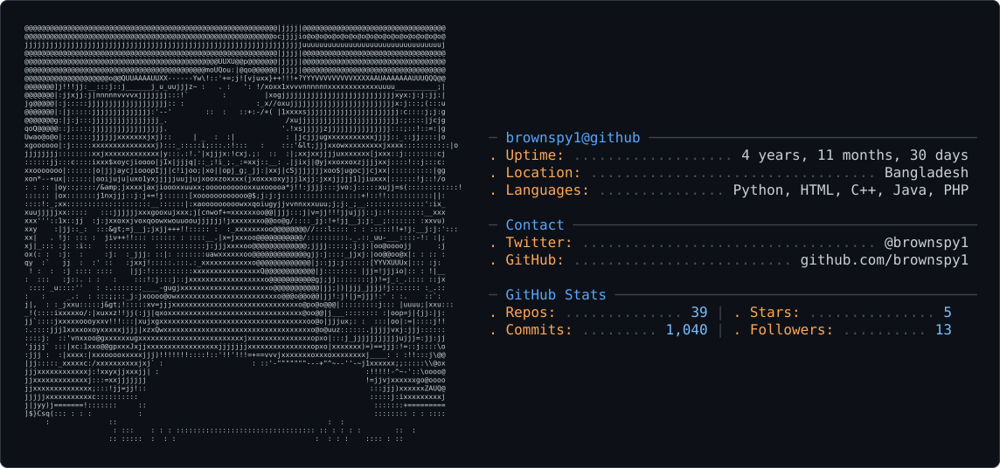

<picture>
  <source media="(prefers-color-scheme: dark)" srcset="dark_mode.svg" />
  <source media="(prefers-color-scheme: light)" srcset="light_mode.svg" />
  
</picture>

<div align="center">


<!-- ══════════════════════════════════════════════════════════
     ANIMATED TYPING HEADER
══════════════════════════════════════════════════════════ -->

[](https://github.com/brownspy1)

<br/>

<!-- ══════════════════════════════════════════════════════════
     BADGES ROW
══════════════════════════════════════════════════════════ -->

[](https://github.com/brownspy1)
[](https://github.com/brownspy1?tab=followers)
[](https://github.com/brownspy1)

</div>

---

<!-- ══════════════════════════════════════════════════════════
     ABOUT ME
══════════════════════════════════════════════════════════ -->

## `$ whoami`

```yaml
name       : M. Mahadi (Md. Mahadi Hasan)
location   : Bangladesh 🇧🇩
role       : Full-Stack Developer & Competitive Programmer
education  : Diploma in Computer Science @ Barisal Polytechnic Institute
status     : 4th Semester Ongoing
mission    : Software Engineer at Google 🚀
learning   : Django • Data Structures • Algorithms
fun_fact   : I have a great sense of humor and will make you laugh 😂
blog       : https://motivedupro.blogspot.com
```

---

<!-- ══════════════════════════════════════════════════════════
     CURRENTLY DOING
══════════════════════════════════════════════════════════ -->

## `$ top --processes`

```
🔭  Working on  →  Portfolio Terminal (Live)
🌱  Learning    →  Django | Advanced DSA | System Design
⚔️  Competing   →  Codeforces | LeetCode | HackerRank
📝  Writing     →  Tech articles on Blogspot
🎯  Goal        →  Software Engineer @ Google
```

---

<!-- ══════════════════════════════════════════════════════════
     TECH STACK — LANGUAGES & TOOLS
══════════════════════════════════════════════════════════ -->

## `$ cat skills.json`

### ⚡ Languages

<div align="center">


</div>

### 🔧 Frameworks & Tools

<div align="center">


</div>

### 📊 Skill Levels

```
Python      ████████████████████  95%
C / C++     ██████████████████░░  88%
HTML / CSS  ████████████████████  95%
JavaScript  ███████████████░░░░░  72%
Java        ██████████████░░░░░░  68%
Django      █████████░░░░░░░░░░░  45% [Learning 🔥]
```

---

<!-- ══════════════════════════════════════════════════════════
     COMPETITIVE PROGRAMMING
══════════════════════════════════════════════════════════ -->

## `$ ./competitive_programmer.sh`

<div align="center">

[](https://codeforces.com/profile/brownspy1)
[](https://leetcode.com/brownspy1)
[](https://hackerrank.com/profile/brownspy1)

</div>

---

<!-- ══════════════════════════════════════════════════════════
     GITHUB STATS
══════════════════════════════════════════════════════════ -->

## `$ git stats --all`

<div align="center">


<br/><br/>


</div>

---

<!-- ══════════════════════════════════════════════════════════
     SNAKE CONTRIBUTION ANIMATION
══════════════════════════════════════════════════════════ -->

## `$ watch --contributions`

<div align="center">

<picture>
  <source media="(prefers-color-scheme: dark)" srcset="https://raw.githubusercontent.com/brownspy1/brownspy1/output/github-contribution-grid-snake-dark.svg"/>
  <source media="(prefers-color-scheme: light)" srcset="https://raw.githubusercontent.com/brownspy1/brownspy1/output/github-contribution-grid-snake.svg"/>
  
</picture>

</div>

---

<!-- ══════════════════════════════════════════════════════════
     ACTIVITY GRAPH
══════════════════════════════════════════════════════════ -->

## `$ git log --graph --all`

<div align="center">

[](https://github.com/brownspy1)

</div>

---

<!-- ══════════════════════════════════════════════════════════
     QUOTE
══════════════════════════════════════════════════════════ -->

## `$ fortune | cowsay`

<div align="center">

[](https://github.com/brownspy1)

</div>

---

<!-- ══════════════════════════════════════════════════════════
     CONNECT / SOCIALS
══════════════════════════════════════════════════════════ -->

## `$ ping social --all`

<div align="center">

[](https://brownspy1.github.io/brownspy1/)
[](https://github.com/brownspy1)
[](https://linkedin.com/in/m-mahadi-hasan-aa8422228)
[](https://twitter.com/brownspy1)
[](https://fb.com/brownspy1)
[](https://instagram.com/brownspy1)
[](https://www.youtube.com/c/brownspy1)
[](https://discord.gg/brownspy1)
[](https://motivedupro.blogspot.com)

<br/>

[](mailto:mh0643893@gmail.com)
[](mailto:brownspy1@protonmail.com)

</div>

---

<!-- ══════════════════════════════════════════════════════════
     SUPPORT
══════════════════════════════════════════════════════════ -->

## `$ sudo support`

<div align="center">

<a href="https://www.buymeacoffee.com/brownspy1">
  
</a>

<br/><br/>


</div>
